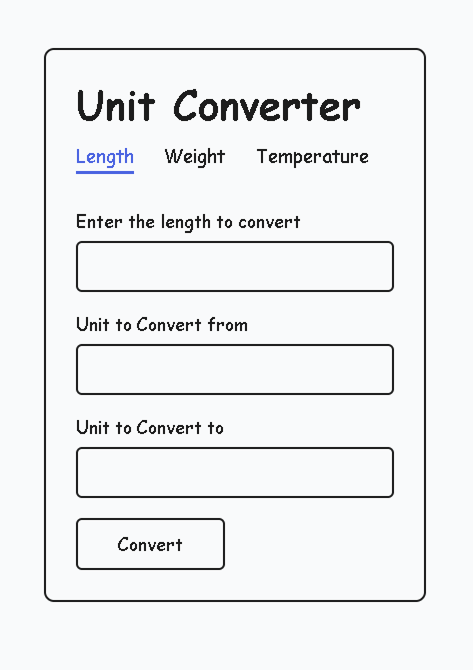
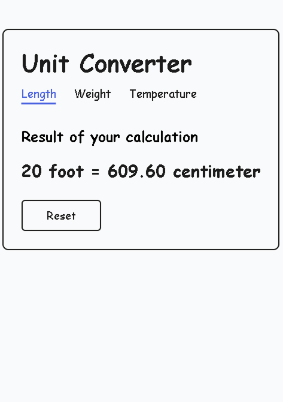

# **Unit Converter Web App**

## 🚀 **Overview**

A simple and efficient unit converter web application that allows users to convert between different units of measurement for **length, weight, and temperature**. Users can input a value, select the units to convert from and to, and view the converted result instantly. The application is built using **HTML, CSS, JavaScript (Frontend), and Node.js with Express.js (Backend)**.

🔗 **Project URL:** [Unit Converter Project on Roadmap.sh](https://roadmap.sh/projects/unit-converter)

## 🌟 **Features**

- Convert between multiple units of **Length, Weight, and Temperature**.
- Simple and user-friendly interface.
- Form-based input submission and result display.
- No database required – everything is processed server-side.
- Dynamic page updates for seamless user experience.

## 📷 **Screenshots**

### Home Page - Length Converter



### Converted Value



## 🛠️ Technologies Used

- **Frontend:** HTML, CSS, JavaScript
- **Backend:** Node.js, Express.js
- **Styling:** Custom CSS

## 🔧 **Installation & Setup**

### 1️⃣ Prerequisites

Ensure you have **Node.js** installed on your system. You can download it from [Node.js official website](https://nodejs.org/).

### 2️⃣ Clone the Repository

```sh
git clone https://github.com/zeeeshan2423/unit-converter.git
cd unit-converter
```

### 3️⃣ Install Dependencies

```sh
npm install
```

### 4️⃣ Run the Server

```sh
npm start
```

The server will start at `http://localhost:3000/`.

## 📌 **Usage**

1. Open `http://localhost:3000/` in your browser.
2. Choose a conversion category (Length, Weight, or Temperature).
3. Enter a value, select the units to convert from and to.
4. Click **Convert** to see the result.

## 📁 **Project Structure**

```
unit-converter/
│── public/
│   ├── styles.css          # Main CSS file
│   ├── screenshots/        # Contains screenshots for README
│── views/
│   ├── length.html         # Length converter page
│   ├── weight.html         # Weight converter page
│   ├── temperature.html    # Temperature converter page
│── server.js               # Main server file
│── package.json            # Project metadata and dependencies
│── README.md               # Project documentation
```

## 📜 **License**

This project is **open-source** and available under the **MIT License**.

## 🤝 **Contributing**

Feel free to fork the project and submit pull requests. Suggestions and improvements are always welcome!

## 📬 **Contact**

👨‍💻 Developed by **Mohammad Zeeshan Khan**  
For any questions or suggestions, reach out at [zeeshan2423@gmail.com](mailto:zeeshan2423@gmail.com) or open an issue in the repository.
